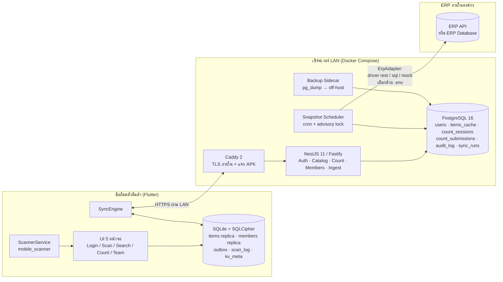
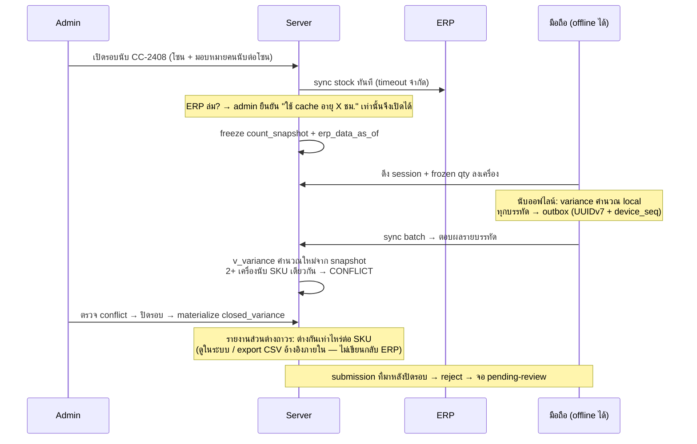

# สถาปัตยกรรมระบบ — TCL Mobile Stock Check

> **สถานะ:** ออกแบบเสร็จสมบูรณ์ ผ่านการตรวจสอบเชิงปฏิปักษ์ (adversarial verification) 3 มุมมองแล้ว — พร้อมสำหรับการทำแผน implement
> **Design ต้นแบบ:** `Mobile Stock Check System/Stock Scan Mobile.dc.html` (TCL v4.0) — ดูสัญญาความตรงกับ design ที่ [`design-fidelity.md`](design-fidelity.md)
> **ERP:** on-premise ภายในองค์กร — **DB เป็น Microsoft SQL Server (ยืนยัน 17 ส.ค. 2569)** เชื่อมแบบอ่านอย่างเดียวด้วย driver `sql` (dialect `mssql`) โดยใช้ script ดึง Inventory ที่เจ้าของโปรเจคส่งมอบเป็น query contract — คอนฟิกด้วย `.env` ทั้งหมด ดู [`erp-integration.md`](erp-integration.md)

---

## 1. หลักการออกแบบ (Architecture Principles)

1. **Offline-first** — คลังสินค้ามีจุดอับสัญญาณ WiFi: การสแกนและการนับต้องทำงานได้ 100% โดยไม่มีเน็ตเวิร์ก ข้อมูลอ่านมาจาก replica ในเครื่อง ข้อมูลเขียนเข้าคิว (outbox) แล้วซิงค์ทีหลัง
2. **ERP คือระบบภายนอกที่ล่มได้เสมอ** — มีเพียง backend เท่านั้นที่คุยกับ ERP และคุยผ่าน adapter + cache: ERP ล่ม ≠ นับสต็อกไม่ได้
3. **Append-only + idempotent** — ผลการนับเป็น event ที่เพิ่มได้อย่างเดียว (ไม่แก้ไข) พร้อม idempotency key: retry กี่ครั้งก็ไม่นับซ้ำ
4. **Server เป็นผู้ตัดสิน** — variance ไม่เชื่อจาก client เด็ดขาด คำนวณใหม่ที่ server เทียบกับ snapshot ที่ freeze ตอนเปิดรอบนับเสมอ; สิทธิ์ (role) ตรวจซ้ำที่ server ทุก endpoint
5. **Ops ต้องง่ายระดับ SME** — ทีมเล็กดูแลได้: `docker compose up -d` คือเรื่องราวทั้งหมดของการ deploy, `.env` ไฟล์เดียวคุมทุกอย่าง, มี runbook สั้น ๆ

---

## 2. ภาพรวมระบบ



**เส้นทางข้อมูลหลัก:** ERP → (adapter อ่านตามรอบ) → `items_cache` ใน Postgres → (delta feed) → SQLite บนมือถือ → สแกน/ค้นหา/นับแบบ local ทันที → ผลการนับเข้า outbox → ซิงค์ขึ้น server → server คำนวณ **ส่วนต่าง (variance)** เทียบยอดระบบ → ดูผลต่างได้ทันทีทั้งบนเครื่องและรายงานฝั่ง admin

**เส้นทางยอดสด (ตั้งแต่ 24 ส.ค. 2569):** มือถือออนไลน์เรียก `GET /items/search` หรือ `GET /items/by-barcode/:code` → `CatalogService` อ่านข้อมูลสินค้าจาก `items_cache` แล้ว **ทับยอดคงเหลือด้วยค่าสดจาก ERP** (`ErpAdapter.fetchItemsBySku` — SELECT ล้วน) → ERP ไม่ตอบภายใน 4 วินาที ตกกลับไปใช้ยอดของรอบ sync ล่าสุด พร้อมส่ง `onHandSource: 'cache'` ให้มือถือขึ้นป้าย "ณ HH:mm"

**ยอดตั้งต้นของรอบนับยังตรึงเหมือนเดิม** — `count_snapshot` freeze ตอนเปิดรอบ ไม่ยิงสด เพราะถ้ายอดตั้งต้นขยับระหว่างนับ ส่วนต่างจะเปลี่ยนไปเรื่อยจนเทียบไม่ได้

> ## 🚫 กฎเหล็กของโปรเจค: ไม่มีการเขียนกลับ ERP โดยเด็ดขาด
>
> **คำสั่งเจ้าของโปรเจค (ย้ำ 17 ส.ค. 2569) — ไม่มีข้อยกเว้น ไม่ใช่การเลื่อนไปเฟสหลัง**
> ERP (`db_TCL` บน SQL Server) เป็นแหล่ง **อ่านอย่างเดียว** ระบบมีหน้าที่ให้กรอกค่าที่นับได้จริงแล้วแสดงว่าต่างจากยอดระบบเท่าไร ผลส่วนต่างเก็บเป็นรายงานถาวรในระบบนี้
> บังคับ 5 ชั้น (สิทธิ์ DB `db_datareader` · boot probe ที่ปฏิเสธ start ถ้าเขียนได้ · statement guard รับเฉพาะ SELECT/WITH · interface ไม่มี method เขียน · read-only connection) — รายละเอียดใน [`erp-integration.md`](erp-integration.md)

---

## 3. สแต็กเทคโนโลยี (ตัดสินใจแล้ว พร้อมเหตุผล)

### 3.1 Mobile — Flutter

| ส่วน | เลือกใช้ | เหตุผล |
|---|---|---|
| Framework | **Flutter 3.35+ / Dart 3.9** | ข้อกำหนดของโปรเจค |
| State management | **Riverpod 3** + riverpod_generator | DI แบบ compile-safe, จับคู่กับ drift `watch()` stream ได้เป็นธรรมชาติ, พิธีกรรมน้อยกว่า Bloc สำหรับแอป ~6 หน้าจอ |
| Local DB | **drift 2.28+** (SQLite, WAL mode) บน **SQLCipher** (`sqlcipher_flutter_libs`) | drift เป็นตัวเลือกที่ maintain ต่อเนื่องที่สุด (Isar/Hive ถูกทิ้งร้าง/เป็น community fork), รองรับ query แบบ type-safe + index + transaction + reactive stream; เข้ารหัส DB เพราะเครื่องหายทั้ง item master และผลนับต้องไม่หลุด — กุญแจเก็บใน Keystore/Keychain |
| Barcode scan | **mobile_scanner ^7.0** | ห่อ CameraX + ML Kit (Android) / AVFoundation + Vision (iOS); รองรับครบ 5 ฟอร์แมตตาม design: `ean13, ean8, code128, code39, qrCode`; มี `scanWindow` ROI ตรงกับกรอบ viewfinder ของ design; มี torch API |
| | ⚠️ ใช้ **DetectionSpeed.normal + cooldown ต่อ barcode ~1.5–2 วิ** (ห้ามใช้ `noDuplicates`) | design กำหนดว่าสแกนซ้ำรายการเดิมต้อง "เด้งขึ้นบนสุดพร้อมเวลาใหม่" — `noDuplicates` จะกดพฤติกรรมนี้ทิ้ง |
| | ⚠️ บังคับ **bundled ML Kit artifact** ใน Android build | เครื่องราคาถูกที่ไม่มี Google Play Services / สแกนครั้งแรกในจุดอับสัญญาณ จะพังเงียบ ๆ ถ้าใช้ unbundled |
| HTTP | **dio ^5.9** + interceptor refresh token + pin root CA ของ Caddy | ดูหัวข้อ 8 (TLS บน LAN) |
| Secure storage | **flutter_secure_storage ^10** | เก็บ token + PIN verifier + กุญแจ SQLCipher |
| Connectivity | **connectivity_plus ^6** — ใช้เป็น "คำใบ้" เท่านั้น | สถานะ link ≠ server ถึงจริง: การตัดสิน online/offline ใช้ probe `GET /healthz` เสมอ |
| Background sync | **workmanager** (Android periodic 15 นาที) + drain ทันทีเมื่อแอปกลับ foreground | Dart timer ตายเมื่อแอปถูก kill/Doze — sync เป็น foreground-first, background เป็น best-effort |
| ฟอนต์ | **IBM Plex Sans Thai + Space Grotesk แบบ bundle ใน assets** (ห้าม fetch runtime) | เครื่องคลังออฟไลน์บ่อย; ⚠️ ฟอนต์ default ของ TextTheme คือ **IBM Plex Sans Thai** และใช้ Space Grotesk เฉพาะจุดที่ design ระบุ (ตัวเลข/SKU/แบรนด์/keypad) — ห้ามกลับด้าน ดู design-fidelity.md §4 |
| i18n | flutter_localizations + ARB, **th เป็น template locale** | ข้อความไทยใน design คือ canonical strings |
| Haptics | `HapticFeedback` ในตัว Flutter | สั่นทุกครั้งที่ decode ได้ (ทั้งเจอและไม่เจอสินค้า — ตาม design) |
| อื่น ๆ | `characters` (ตัดอักษรย่อชื่อไทยแบบ grapheme-safe), `permission_handler` | ชื่อไทยขึ้นต้นด้วยสระ/วรรณยุกต์ต้องไม่แตก |

### 3.2 Backend — NestJS

| ส่วน | เลือกใช้ | เหตุผล |
|---|---|---|
| Runtime | **Node 22 LTS + TypeScript 5.9** | ecosystem ที่ integrator ไทยคุ้นที่สุด, container เดียวเบา ๆ |
| Framework | **NestJS 11 บน Fastify adapter** | โครงสร้าง module/guard/DI คุ้มค่ากับ role model + adapter factory; Fastify เร็วกว่า Express |
| Validation | **zod** (nestjs-zod) — ทั้ง request และ **คอนฟิก `.env` ตอน boot** | fail fast พร้อมบอกชื่อตัวแปรที่ขาดเป๊ะ ๆ — `.env` คนกรอกเอง diagnostics คือฟีเจอร์หลัก |
| Auth | **argon2id** (+ server pepper) สำหรับ PIN, `@nestjs/jwt`, `@fastify/rate-limit` | PIN 6 หลักเป็น credential เอนโทรปีต่ำ ต้อง hash แบบช้า |
| Scheduling | `@nestjs/schedule` + **Postgres advisory lock กันรอบซ้อน** | ดึง item master 50k แถวอาจนานกว่ารอบ cron — ห้ามให้ 2 รอบวิ่งพร้อมกัน |
| Logging | pino → stdout (Docker log พร้อม max-size cap) | |
| ไม่ใช้ message broker | Postgres คือคิว | YAGNI ที่สเกล SME — ตารางธรรมดาพอ |

### 3.3 ทำไมไม่ใช้ตัวเลือกอื่น (สรุปจากการประกวดแบบ 3 สถาปัตยกรรม)

ผ่านการเสนอแบบอิสระ 3 แนวทาง แล้วให้กรรมการ 3 มุมมอง (Ops / Product / Integration) ให้คะแนน:

| แนวทาง | คะแนนรวม | ผลตัดสิน |
|---|---|---|
| **offline-first-sync** (ชนะ) | 126 | โครง local-first + outbox + server-recompute ตอบโจทย์คลังสินค้าที่สุด |
| pragmatic-monolith | 125 | แพ้เฉียดฉิว — ความคิดที่ดีถูก graft เข้ามา (mock driver, golden tests ไทย, แจก APK ผ่าน Caddy, sync ตอนเปิดรอบนับ) |
| integration-hexagonal | 122 | hexagonal เต็มรูปแบบหนักเกินไปสำหรับทีมเล็ก — แต่ contract ของ adapter, boot-time validation, audit ถูก graft เข้ามาทั้งหมด |

- **Go backend:** ops story ดีสุด (binary เดียว) แต่ talent pool ไทยเล็กกว่า Node มาก
- **Dart shelf/Serverpod:** ภาษาเดียวทั้ง stack แต่ ecosystem ฝั่ง server บาง
- **Firebase/Supabase:** ตัดทิ้ง — ระบบต้องอยู่บน LAN ไม่มี dependency กับ cloud

---

## 4. ฐานข้อมูล

### 4.1 PostgreSQL (server — system of record)

```sql
users             (emp_id PK, name, role, shift, warehouse_code,
                   role_version, failed_attempts, throttle_until,
                   created_at, updated_at,
                   pin_hash·must_change_pin ← เลิกใช้แล้ว คาไว้เป็นตาข่ายย้อนกลับ ลบใน Phase 5)
user_credentials  (login_name PK, emp_id FK UNIQUE, secret_hash argon2id, source,
                   absent_since, secret_rotated_at, created_at, updated_at)
                   -- credential แยกจาก users เพราะ users.emp_id ถูก FK อ้างจาก 9 ตาราง
                   -- ลบสิทธิ์ = ลบแถวนี้ ไม่ใช่ลบคนออกจาก users
refresh_tokens    (token_hash PK, emp_id FK, device_id, issued_at, expires_at,
                   rotated_from, revoked_at)
devices           (device_id PK, model, app_version, last_seen_at,
                   queue_depth, oldest_pending_age)          -- heartbeat จากทุกการ sync
items_cache       (sku PK, name, name_en, loc, on_hand, reserved, rop, unit,
                   specs jsonb, warehouse_code, erp_updated_at,
                   row_version BIGSERIAL,                     -- cursor ภายใน (ห้าม cursor ด้วยเวลา ERP)
                   deleted_at)                               -- soft delete = tombstone
item_barcodes     (barcode PK, sku FK)                       -- 1 สินค้า : N บาร์โค้ด, บาร์โค้ดว่างได้
count_sessions    (id PK เช่น 'CC-2408', zone, warehouse_code, status open|closed,
                   opened_at, closed_at, erp_data_as_of)     -- อายุข้อมูล ERP ตอน freeze
count_snapshot    (session_id FK, sku, frozen_on_hand)       -- baseline ตอนเปิดรอบ
count_zone_assign (session_id FK, zone, emp_id)              -- โซนต่อคนนับ (กันนับชนกัน)
count_submissions (idempotency_key UUID PK,                  -- UUIDv7 จาก client
                   session_id FK, sku, counted_qty, emp_id, device_id,
                   device_seq BIGINT,                        -- ลำดับ monotonic ต่อเครื่อง
                   counted_at, received_at, payload_hash)    -- append-only ห้ามแก้
closed_variance   (session_id FK, sku, frozen_on_hand, final_counted_qty, diff,
                   resolved_by, materialized_at)             -- ผลส่วนต่างถาวร ณ จุดปิดรอบ
                                                             -- = คำตอบ "ต่างกันเท่าไหร่" (ไม่ส่งกลับ ERP)
audit_log         (id PK, actor, action, payload jsonb, created_at)  -- append-only
scan_events       (id PK, emp_id, device_id, barcode, sku, scanned_at)
sync_runs         (id PK, driver, kind items|stock, started_at, finished_at,
                   rows_upserted, rows_tombstoned, status, error, anomalies jsonb)
```

**View `v_variance`:** submission ล่าสุดต่อ (session_id, sku) เทียบ `count_snapshot` → `diff = counted_qty − frozen_on_hand`
**กติกา "ล่าสุดชนะ" มีขอบเขต:** ภายในเครื่องเดียว = เรียงตาม `device_seq`; **ข้ามเครื่อง (2+ device นับ SKU เดียวกันในรอบเดียวกัน) = สถานะ CONFLICT ให้ admin เลือกเอง — ห้าม auto-resolve** เพราะ `received_at` คือลำดับการซิงค์ ไม่ใช่ลำดับการนับจริง

### 4.2 SQLite บนเครื่อง (drift + SQLCipher)

```
items      — replica ของ item master (index: barcode, sku) + tombstone
barcodes   — replica ของ item_barcodes (สแกน lookup แบบ exact-match)
members    — replica ของ roster (Team tab, header identity, role gate ทำงานออฟไลน์ได้)
session    — รอบนับ active + frozen qty (นับออฟไลน์ได้เต็มรูปแบบ)
outbox     — id UUIDv7 PK, type, payload_json, device_seq, status
             queued|inflight|acked|failed_terminal, attempts, next_retry_at
scan_log   — ประวัติสแกนในเครื่อง
kv_meta    — sync cursor (row_version), stock_as_of, config flags, clock offset
```

---

## 5. API Surface (สรุป)

| Endpoint | สิทธิ์ | หมายเหตุ |
|---|---|---|
| `POST /auth/login` | – | empId + รหัสผ่าน ERP → access JWT (15 นาที) + refresh (30 วัน, rotate แบบมี grace window 60 วิ ต่อ device — กัน WiFi หลุดแล้วโดน revoke ทั้ง family) |
| `POST /auth/refresh` | – | **ห้าม version-gate** — เครื่องเก่า N-1 ต้อง refresh ได้เสมอ |
| `POST /auth/unlock/:empId` | admin | ปลดล็อคพนักงานที่โดน throttle |
| `GET /items?since={row_version}` | ทุก role | delta feed สำหรับ replica — **รวม tombstone**; cursor คือ `row_version` ภายใน ไม่ใช่เวลา ERP |
| `GET /items/by-barcode/:code` | ทุก role | 404 → toast "ไม่พบบาร์โค้ดนี้ในคลัง · not found" |
| `GET /items?q=` | ทุก role | ค้นหา substring (name+nameEn+sku+barcode) จำกัดผลลัพธ์ + แบ่งหน้า |
| `GET /members?since=` | ทุก role | delta ของ roster + role — ส่งมากับทุกรอบ sync เพื่อให้ role gate ในเครื่อง update เร็ว |
| `POST /sync/users` | admin | ดึง roster จาก `menuuser` ของ ERP มา sync — **ไม่มี endpoint สร้างสมาชิกในแอปแล้ว** |
| `PATCH /members/:empId/role` | admin | ตรวจ role กับ DB (`role_version`) ไม่เชื่อ JWT claim; กันลด role ตัวเองจน **ไม่มี admin เหลือ** |
| `GET /count-sessions/active` | ทุก role | id, zone, รายการนับ, frozen qty, `erp_data_as_of` |
| `POST /count-sessions/:id/submissions` | staff, admin | **batch + per-line result envelope** (ดู §6.3); **ห้าม version-gate**; viewer → 403 |
| `POST /count-sessions` / `:id/close` | admin | ปิดรอบ = **materialize** `closed_variance`; submission ที่มาช้ากว่านั้น → reject เข้าจอ pending-review |
| `GET /count-sessions/:id/conflicts` | admin | รายการ CONFLICT (หลายเครื่องนับ SKU เดียวกัน) + superseded report |
| `GET /count-sessions/:id/variance` | staff, admin | **รายงานส่วนต่าง** — ระหว่างรอบ: live จาก `v_variance`; หลังปิดรอบ: จาก `closed_variance` (+ `?format=csv` สำหรับ export อ้างอิงภายใน) |
| `POST /erp/sync` | admin | สั่ง sync ทันที (นอกรอบ cron) |
| `GET /healthz` | – | **liveness เท่านั้น** (event loop + Postgres ping) — Docker healthcheck ชี้ที่นี่ |
| `GET /healthz/erp` | admin | สถานะ ERP แยกต่างหาก — **ERP ล่มห้ามทำให้ container unhealthy** |
| `GET /meta` | – | minVersion + APK ล่าสุด (แจกผ่าน Caddy) |

---

## 6. Offline-First: กลไกซิงค์

### 6.1 ฝั่งอ่าน — Replicate

- item master ทั้งคลัง (5–50k แถว — จิ๋วสำหรับ SQLite) ไหลลงเครื่องผ่าน `GET /items?since={row_version}` โดย SyncEngine ดึงเมื่อ: probe เจอ server / เข้า foreground / timer
- ป้ายบอกอายุข้อมูล **"ข้อมูล ณ HH:MM"** อ่านจาก `stock_as_of` = เวลา **ดึงจาก ERP สำเร็จครั้งล่าสุด** (ไม่ใช่ max ของ erp_updated_at ซึ่งจะโกหกเมื่อไม่มีอะไรเปลี่ยน)
- tombstone มากับ delta feed → replica ลบสินค้าที่หายจาก ERP ได้

### 6.2 ฝั่งเขียน — Outbox

ทุก mutation (`submit_count_line`, `change_role`, `scan_event`) คือ command ใน outbox พร้อม:
- **UUIDv7** idempotency key (time-ordered — index ดีกว่า v4)
- `device_seq` monotonic ต่อเครื่อง (ตัดปัญหานาฬิกาเครื่องเพี้ยน — `counted_at` ใช้แสดงผลเท่านั้น และเก็บ clock offset จากทุก sync handshake ไว้ปรับแก้)
- สถานะ `queued → inflight → acked | failed_terminal`
- กดปุ่ม "ส่งผลการนับ" = enqueue **เฉพาะบรรทัดที่เปลี่ยน** (diff กับที่เคย enqueue) + toast ทันที (optimistic ตาม design) — ไม่ enqueue ซ้ำทั้งชุด
- retry แบบ exponential backoff + jitter (2 วิ → เพดาน 5 นาที) — **แต่ gate ด้วย probe `/healthz`** ไม่ใช่สถานะ WiFi

### 6.3 สัญญา ingest ที่ server

`POST /count-sessions/:id/submissions` รับ batch แล้วตอบ **HTTP 200 พร้อมผลรายบรรทัด**:

```json
[{ "idempotencyKey": "...", "status": "accepted" | "duplicate" | "rejected", "code": "SESSION_CLOSED" | "ROLE_CHANGED" | ... }]
```

- `accepted` / `duplicate` → outbox แถวนั้น `acked` (duplicate ตรวจ `payload_hash` — ถ้า payload ต่างจากที่เก็บไว้ = log ความผิดปกติ)
- `rejected` → `failed_terminal` → แสดงใน **จอ pending-review** (งานไม่หายเงียบ ๆ เช่น "สิทธิ์ถูกเปลี่ยน — รอผู้ดูแลตรวจสอบ")
- transport-level 4xx/5xx สงวนไว้สำหรับ request พังทั้งก้อน (auth/JSON เสีย) เท่านั้น

### 6.4 รอบนับ (Count Session) end-to-end



---

## 7. Authentication & Authorization

- **Login:** empId + PIN 6 หลัก → `argon2id(PIN + pepper)`; error code แยก `UNKNOWN_EMPLOYEE` / `INVALID_PIN` ตรงกับ 2 ข้อความใน design (ยอมรับ residual risk เรื่อง user enumeration แบบ LAN-only — **ห้าม expose API ออกนอก LAN**)
- **กัน brute force แบบไม่ DoS ตัวเอง:** ใช้ **escalating delay ต่อ empId** (1s/5s/30s/…) แทนการล็อคตายตัว (การล็อค 15 นาทีคือช่องให้ใครก็ได้ยิง PIN ผิด 5 ครั้งเพื่อล็อคพนักงาน — empId เดาง่ายจากป้ายชื่อ 52xxx); bucket ของ rate-limit ผูกกับ **device installation ID** ไม่ใช่ IP (ทั้งคลัง NAT ออก IP เดียว); admin คนสุดท้ายห้ามล็อคเต็มรูปแบบ; มี endpoint ปลดล็อคโดย admin
- **Token:** access 15 นาที (claims: `sub, role, wh, role_version`), refresh 30 วัน rotate แบบ idempotent (grace 60 วิ) — endpoint ที่ blast radius สูง (member CRUD, ปิดรอบ) ตรวจ `role_version` กับ DB เสมอ
- **Offline unlock:** หลัง login online สำเร็จครั้งแรกบนเครื่องนั้น เก็บ argon2id verifier ต่อพนักงานต่อเครื่อง (TTL จำกัด) → ปลดล็อคในจุดอับได้; เครื่องที่ยังไม่เคย login ของคนนั้น = ต้องต่อเน็ตครั้งแรก (มีข้อความ UI เฉพาะ + เป็น SOP "login ที่จุด dock ก่อนเข้า") — **ห้าม** pre-distribute verifier ทั้ง roster ลงทุกเครื่อง
- **Role matrix (ตรงกับ design + บังคับซ้ำที่ server):**

| การกระทำ | viewer | staff | admin |
|---|---|---|---|
| สแกน / ค้นหา / ดูข้อมูล | ✓ | ✓ | ✓ |
| นับสต็อก + ส่งผลการนับ | ✗ (toast "สิทธิ์ viewer นับสต็อกไม่ได้") | ✓ | ✓ |
| เปลี่ยน role (สมาชิกมาจาก ERP — สร้างในแอปไม่ได้) | ✗ | ✗ | ✓ |
| เปิด–ปิดรอบนับ / อนุมัติ variance / สั่ง sync | ✗ | ✗ | ✓ |

- **Sign-out:** เคลียร์ token + หยุดกล้อง + reset UI **แต่ห้ามแตะ outbox** (งานค้างซิงค์ภายใต้ actor เดิม) — และ **เคลียร์ counts/query ของ user เดิม** (เครื่องใช้ร่วมกัน — deviation จาก demo ที่จงใจ ดู design-fidelity.md §6)

---

## 8. Deployment & Operations

### 8.1 Docker Compose (ทั้งหมดบนเซิร์ฟเวอร์ LAN เครื่องเดียว)

```yaml
services:
  api:        # NestJS multi-stage → node:22-slim, healthcheck GET /healthz (liveness เท่านั้น)
              # migration รันใน entrypoint ใต้ Postgres advisory lock (รันครั้งเดียวแน่นอน)
  postgres:   # postgres:16-alpine + named volume
  caddy:      # TLS ภายใน (internal CA) + reverse proxy + แจก APK + root CA bootstrap ผ่าน HTTP
  backup:     # sidecar: pg_dump รายคืน → volume → rsync/rclone ออกนอกเครื่อง (NAS/เครื่องสำรอง)
              # retention 14–30 วัน + แจ้งเตือนเมื่อ dump ล่าสุดออกนอกเครื่องเก่ากว่า 26 ชม.
# ทุก service: restart: unless-stopped, logging max-size/max-file, image pin ด้วย digest
```

**Prereq ของ host (อยู่ใน runbook):** NTP (chrony) — นาฬิกาเครื่องนี้คือลำดับ `received_at` และวันที่ พ.ศ. ทั้งระบบ, DHCP reservation, disk-space alert

### 8.2 TLS บน LAN (จุดที่พังง่ายที่สุด — ออกแบบเผื่อแล้ว)

- Android 7+ **ไม่เชื่อ CA ที่ user ติดตั้งเอง** → **bundle root CA ของ Caddy ลงในแอป Flutter แล้ว pin ที่ root** (dio + SecurityContext) — ไม่พึ่งการลง cert บนเครื่อง
- **ห้ามใช้ `stock.local`** (mDNS — Android resolve ไม่ได้บ่อย) → ใช้ `stock.lan` ผ่าน DNS ของ router หรือ IP นิ่ง + SAN cert
- Caddy เปิดพอร์ต HTTP เปล่าไว้ **เฉพาะ**แจก root cert + APK ตอน setup เครื่องแรก (แก้ปัญหาไก่กับไข่)

### 8.3 การแจกและอัปเดตแอป (sideload fleet)

- APK เวอร์ชันล่าสุดวางบน Caddy, `/meta` ประกาศ `minVersion` → แอปมี prompt อัปเดต
- **ห้าม version-gate เส้นทาง ingest + refresh** (รับ N-1 เสมอ) — เครื่องที่ออฟไลน์ทั้งกะต้องส่งงานค้างได้ก่อนถูกบังคับอัปเดต; SOP: วาง APK → รอ telemetry บอกว่า fleet อัปเดตครบ → ค่อยขยับ minVersion
- **Signing keystore สร้างวันแรก เก็บ 2 ที่นอกเครื่อง** (สูญหาย = ต้อง uninstall ทั้ง fleet = **ข้อมูล outbox ที่ยังไม่ซิงค์หายด้วย**)

### 8.4 Observability สำหรับคนไม่ใช่ dev

- `sync_runs` — จุดแรกที่ดูเมื่อ "ทำไมสต็อกไม่อัปเดต" (ทุก), รอบ sync บันทึก driver/แถว/ผล/ความผิดปกติ
- `devices` heartbeat — เห็นว่าเครื่องไหนถืองานค้างเท่าไร last-seen เมื่อไร → **เครื่องหายพร้อมงานนับ 2 ชม. ตรวจจับได้** และมอบโซนใหม่ได้
- Admin ops view ในแอป (หรือหน้า web ง่าย ๆ ระยะแรก): สถานะ ERP, อายุ backup ล่าสุด, เครื่อง + คิวค้าง

---

## 9. Camera Lifecycle (นโยบายชัดเจน — จุดที่แอปสแกนพังบ่อยสุด)

- `stop()` เมื่อ: ออกจากแท็บสแกน, `AppLifecycleState.paused/inactive`
- `start()` เมื่อ: แท็บสแกน visible **และ** ผู้ใช้เปิดกล้องไว้ (`camOn`)
- resume จาก Doze: re-attach + ตรวจ permission ใหม่ (denied ถาวร → สถานะเฉพาะ + ปุ่มไป Settings)
- state machine ของ `camStatus` ครอบคลุมสตริงไทยทั้ง 7 แบบใน design + สถานะจริงบนอุปกรณ์ (ดู design-fidelity.md §5.3)
- ทดสอบ matrix บนฮาร์ดแวร์จริง: สลับแท็บ / background / Doze-resume / kill — และ acceptance gate การสแกน (≥95% first-pass EAN-13 ใต้แสงคลังจริง) ก่อนสั่งซื้อ fleet; ถ้าไม่ผ่าน มีแผนสำรองเป็น commercial SDK (Scanbot/Scandit — งบต้อง flag แต่แรก)

---

## 10. ความเสี่ยงหลักที่เหลือ + ท่าจัดการ

| ความเสี่ยง | ท่าจัดการ |
|---|---|
| 2 คนนับโซนเดียวกันออฟไลน์พร้อมกัน | มอบโซนต่อคนตอนเปิดรอบ + server reject โซนที่ไม่ได้รับมอบ + CONFLICT ให้ admin ตัดสิน |
| ERP ให้ item master ไม่ครบ (ดึงขาด) | tombstone ได้เฉพาะจากรอบ full-reconcile ที่ยืนยันครบ + guardrail ห้ามลบเกิน 5%/รอบ + ห้ามขยับ cursor เมื่อรอบไม่สมบูรณ์ |
| ความหมายข้อมูล ERP ไม่ตรง (reserved/UoM/พ.ศ.-ค.ศ.) | field map มี `{path, type, format, dateEra, uomFactor}` + zod validate + **รายงาน reconcile 20 รายการเทียบหน้าจอ ERP/ชั้นวางจริงก่อน go-live** |
| เซิร์ฟเวอร์ LAN เครื่องเดียวตาย | เครื่องมือถือยังสแกน/นับต่อได้ (offline-first) + backup off-host + restore runbook ซ้อมจริงรายไตรมาส + สำรองเครื่องเปล่า |
| ML Kit อ่านฉลากเสีย/มันวาว/แสงน้อยไม่ได้ | ROI + torch + ปุ่มกรอกบาร์โค้ดมือ (design extension) + acceptance gate ก่อนซื้อ fleet |
| สเกล: ไทย typography ที่ metric แน่น | StrutStyle ต่อ scale step, ห้าม letterSpacing กับสคริปต์ไทย, golden tests สตริงวรรณยุกต์หนักทุกขนาด |

---

## 11. ขอบเขตที่ **ไม่ทำ** (ตัดสินใจแล้ว)

- ❌ **การเขียนค่ากลับ ERP — ตัดออกถาวร** (การตัดสินใจของเจ้าของโปรเจค 17 ส.ค. 2569): ระบบรับค่าที่นับได้จริงแล้วแสดงส่วนต่างเทียบยอดระบบเท่านั้น ผลเก็บใน `closed_variance` + export CSV อ้างอิงภายใน — โมเดล submission แบบ append-only รองรับการเพิ่มฟีเจอร์นี้ภายหลังได้โดยไม่ต้อง migrate ถ้าเปลี่ยนใจ
- ❌ multi-warehouse UI — แต่ `warehouse_code` ฝังทุกตารางตั้งแต่วันแรก (ราคา 1 คอลัมน์ vs migration เจ็บ ๆ)
- ❌ iOS fleet — Android-first (sideload); iOS build เขียวไว้เฉย ๆ
- ❌ รายงาน/dashboard บน desktop — admin ops view ขั้นต่ำพอ

## 12. งานออกแบบ UI เพิ่มเติมที่ต้องทำก่อน/ระหว่าง implement

design ต้นแบบไม่ครอบคลุมสถานะที่สถาปัตยกรรม offline ต้องมี — ต้องออกแบบเพิ่มด้วยภาษา token เดิม (รายละเอียด + ข้อเสนอใน design-fidelity.md §7):

1. จอ **pending-review** (งานที่ถูก reject ตอน sync)
2. ตัวชี้วัดสถานะซิงค์ (queue-depth badge, ป้าย "ข้อมูล ณ HH:MM", online/offline)
3. สถานะวงจรรอบนับ (ไม่มีรอบ active / รอบถูกปิดระหว่างออฟไลน์ / ใครนับล่าสุดต่อแถว)
4. วงจรล็อกอิน (รหัสผ่านผิด / โดน throttle / "เครื่องนี้ต้องต่อเน็ตครั้งแรก")
6. first-run download + จอ update APK
7. ช่องกรอกบาร์โค้ดมือ (แทนปุ่มจำลอง 1/2/3 ของ demo)
8. รายการนับที่ยาวจริง (ค้นหาในรอบ, จัดกลุ่มตามโซน)

---

*เอกสารนี้สังเคราะห์จาก workflow ออกแบบ 12 agents: สกัด design spec → เสนอ 3 สถาปัตยกรรมอิสระ → กรรมการ 3 มุมมอง → ตรวจเชิงปฏิปักษ์ 3 เลนส์ (design fidelity / ERP integration / mobile+offline+ops) — ข้อบกพร่องวิกฤตทั้ง 7 ข้อที่พบถูกแก้ในแบบข้างต้นแล้ว*
