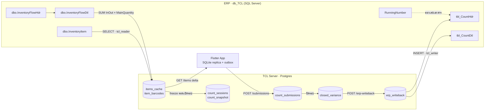

# TCL ⇄ ERP — เอกสาร Mapping ข้อมูลสองทิศทาง

> **สถานะ ณ 27 ส.ค. 2569** · อ้างอิงจากโค้ดจริงในรีโปทุกบรรทัด (ไม่ใช่จากเอกสารเก่า)
> 🔧 **อัปเดต:** ประเด็นในส่วน D ถูกแก้ไปแล้ว 15 จาก 20 ข้อ — ดู [ส่วน F](#ส่วน-f--สิ่งที่แก้ไปแล้ว) และ [ส่วน G วิธีเริ่มทดสอบ](#ส่วน-g--วิธีเริ่มทดสอบ)
> ทุกแถวในเอกสารนี้มีเลขบรรทัดอ้างอิง — เปิดไฟล์ตามนั้นได้ทันที
>
> เอกสารที่เกี่ยวข้อง: [`docs/erp-integration.md`](erp-integration.md) · [`docs/erp-tcl-findings.md`](erp-tcl-findings.md) · [`process/general-plans/active/erp-writeback_PLAN_25-08-26.md`](../process/general-plans/active/erp-writeback_PLAN_25-08-26.md)

---

## 0. สรุปหน้าเดียว

| หัวข้อ | ขาเข้า (ERP → TCL) | ขาออก (TCL → ERP) |
|---|---|---|
| **ฐานข้อมูล** | `db_TCL` (SQL Server) | `db_TCL` (SQL Server) — คนละ connection pool คนละบัญชี |
| **บัญชีที่ใช้** | `tcl_reader` — `db_datareader` ล้วน | `tcl_writer` — INSERT/UPDATE เฉพาะ 3 ตาราง |
| **ตารางที่แตะ** | `InventoryItem` · `InventoryFlowHdr` · `InventoryFlowDtl` (SELECT) | `tbl_CountHdr` · `tbl_CountDtl` · `RunningNumber` (INSERT/UPDATE) |
| **จำนวน field** | 10 คอลัมน์จาก item master + 1 ยอดคำนวณ | หัวเอกสาร 12 คอลัมน์ + รายการ 10 คอลัมน์/แถว |
| **ตัวจุดชนวน** | cron `ERP_SYNC_CRON` (ทุก 30 นาที) + ยิงสดตอนค้นหา/สแกน | `POST /count-sessions/:id/erp-writeback` — admin กดเอง ไม่มี cron |
| **สถานะการใช้งาน** | ✅ ใช้งานจริงแล้ว | ⚠️ **ปิดอยู่** (`ERP_WRITEBACK_ENABLED=false`) และยังไม่เคยเขียนลง ERP จริงแม้แต่แถวเดียว |

**คำตอบสั้น ๆ ของคำถาม “ดึงอะไรมา / ต้องส่งอะไรกลับ”**

- **ดึงมา** = ทะเบียนสินค้า (รหัส · ชื่อไทย/อังกฤษ · หน่วย · จุดสั่งซื้อ · บาร์โค้ด · ชั้นวาง · lot) + **ยอดคงเหลือที่คำนวณสดจาก ledger ตามสูตรของฝ่าย ERP เอง**
- **ส่งกลับ** = เอกสารรอบนับ 1 ใบต่อ 1 รอบ ประกอบด้วยหัวเอกสาร (ใคร · เมื่อไหร่ · เลขที่) + รายการนับ 1 แถวต่อ 1 SKU (ยอดระบบ · ยอดนับได้ · ส่วนต่าง)

---

## 1. แผนภาพเส้นทางข้อมูล



---

# ส่วน A — ขาเข้า: ดึงอะไรมาจาก ERP

## A1. ตาราง ERP ที่แตะฝั่งอ่าน

| ตาราง | ใช้ทำอะไร | เงื่อนไขกรอง |
|---|---|---|
| `dbo.InventoryItem` | ทะเบียนสินค้า (item master) | `IsActive = 1 AND IsStock = 1` |
| `dbo.InventoryFlowHdr` | หัวเอกสารเคลื่อนไหว | `Approved = 1` · `IsClosed <> 1` · `InOutDate <= @asOf` |
| `dbo.InventoryFlowDtl` | รายการเคลื่อนไหว (ใช้คำนวณยอด) | `Warehouse = @warehouse` |

> ทุก statement วิ่งผ่าน `assertReadOnlySql()` ซึ่งบล็อกคีย์เวิร์ดเขียน 19 ตัว และบัญชีที่ใช้ต้องผ่าน permission probe ตอน boot ว่า **ไม่มีสิทธิ์เขียนใด ๆ** ไม่งั้นระบบปฏิเสธการ start
> — `server/src/erp/erp-adapter.ts` · `server/src/erp/drivers/mssql.driver.ts:452` (probe ใช้ `IS_SRVROLEMEMBER`/`HAS_PERMS_BY_NAME` เป็น SELECT ล้วน **ไม่ได้ยิง INSERT ทดสอบ** ตามที่เอกสารเก่าบางฉบับเขียนไว้)

## A2. Mapping ราย field — ERP → TCL → แอป

ไฟล์ต้นทาง: `server/sql/erp/inventory-items-with-balance.sql`

| # | คอลัมน์ ERP | → TS (`CanonicalItem`) | → Postgres (`items_cache`) | → แอป (`ItemDto`) | การแปลง | หมายเหตุจากข้อมูลจริง |
|---|---|---|---|---|---|---|
| 1 | `InventoryItem.ItemCode` | `sku` | `sku` | `sku` | `LTRIM/RTRIM` + dedupe `Roworder` สูงสุดชนะ | PK = (`Roworder`,`ItemCode`) → **รหัสซ้ำได้** ~85 รหัส / 172 แถว |
| 2 | `InventoryItem.ItemName` | `name` | `name` | `name` | trim + `decodeThai()` | `nvarchar(200)` · ว่าง → ใช้ `sku` แทน + log anomaly `blank_name` |
| 3 | `InventoryItem.ItemNameEng` | `nameEn` | `name_en` | `nameEn` | trim 256 · ว่าง → NULL | optional |
| 4 | `InventoryItem.MainUnits` | `unit` | `unit` | `unit` | trim 32 | มีครบ **100%** ในข้อมูลจริง |
| 5 | `InventoryItem.MinStock` | `rop` | `rop` | `rop` | เก็บเฉพาะเมื่อ `> 0` | มีค่าจริง **26.8%** (143/533) — คอมเมนต์ใน `erp-adapter.ts:33` ที่เขียน "ราว 29%" คลาดเคลื่อน |
| 6 | `InventoryItem.BarCodeUnits` | `barcodes[]` | `item_barcodes.barcode` | `barcodes[]` | รวมเป็นชุด unique | มีจริง ~1.9% |
| 7 | `InventoryItem.BarCodePack` | `barcodes[]` | `item_barcodes.barcode` | `barcodes[]` | รวมชุดเดียวกัน | — |
| — | *(ItemCode ใส่เองเป็นบาร์โค้ดตัวแรกเสมอ)* | `barcodes[0]` | `item_barcodes` | `barcodes[0]` | `uniqueNonEmpty([sku, …])` | **ทุก SKU จึงมีบาร์โค้ดอย่างน้อย 1 แถวเสมอ** (Code128 ที่พิมพ์เอง) |
| 8 | `InventoryItem.Shelf` | `loc` | `loc` | `loc` | trim 64 | **ว่าง 100%** ในข้อมูลจริง |
| 9 | `InventoryItem.LotNumber` | `lot` | `specs.lot` (jsonb) | — | trim 64 | **ว่าง 100%** · ไม่มีการกรอง lot ที่ไหนเลย |
| 10 | `InventoryItem.Roworder` | *(ไม่เก็บ)* | — | — | ใช้ตัดสิน dedupe อย่างเดียว | คอลัมน์ `items_cache.erp_roworder` มีอยู่แต่**ไม่เคยถูกเขียน** |
| 11 | `SUM(InOut × MainQuantity)` | `onHand` | `on_hand` | `onHand` + `onHandSource` + `onHandAsOf` | alias `Balqty` → `on_hand` | **ไม่มีแถวใน ledger = NULL ไม่ใช่ 0** (ตั้งใจ) |
| 12 | `@warehouse` (พารามิเตอร์) | `warehouseCode` | `warehouse_code` | — | **config ชนะเสมอ** | item master ของ ERP ไม่มีคอลัมน์คลัง |

**field ที่ ERP ไม่มีให้ (เป็น `undefined` เสมอ):** `vendor` · `lastCountDate` · `updatedAt`
→ `updatedAt` ว่างคือเหตุผลที่ `capabilities().delta = false` และรอบ sync ต้องดึง **snapshot เต็มทุกครั้ง**

## A3. สูตรยอดคงเหลือ (ของฝ่าย ERP เอง — ห้ามแก้เงื่อนไข)

```sql
SUM(d.InOut * d.MainQuantity)
FROM InventoryFlowHdr h
LEFT JOIN InventoryFlowDtl d
  ON h.TranSactionno = d.Transactionno   -- ⚠️ join สองคีย์
 AND h.VoucherNo     = d.VoucherNo
WHERE h.Approved = 1 AND h.IsClosed <> 1
  AND h.InOutDate <= @asOf
  AND d.Warehouse = @warehouse
GROUP BY d.ItemCode
```

- ✅ **ตรวจกับ `db_TCL` จริงแล้ว ตรง 100%** สองรอบนับ (CNT-2608-0001 = 93/93 · CNT-2608-0003 = 96/96 เทียบกับ `tbl_CountDtl.MainQty`) — `docs/erp-tcl-findings.md:174-200`
- ที่เคยได้แค่ 52.1% คือ **จุดตัดเวลาผิด** ไม่ใช่สูตรผิด (`CountDate` ของ ERP ไม่มีเวลา = ยอดถึงสิ้นวันก่อนวันนับ)
- ⚠️ คอมเมนต์เตือน "ยังไม่ verify" ใน `inventory-items-with-balance.sql:25` และ `verify-balance.sql:7-9` เป็น **คอมเมนต์ค้าง** ควรลบ
- `IsClosed <> 1` และ `Approved = 1` ตัดแถว NULL ทิ้งโดยกลไก SQL — ตรวจแล้วใน DB จริงมี NULL **0 แถว** ผลกระทบปัจจุบันเป็นศูนย์

## A4. ดึงตอนไหน

| เส้นทาง | ตัวจุดชนวน | ขอบเขต | หมายเหตุ |
|---|---|---|---|
| รอบ sync | cron `ERP_SYNC_CRON` (default `*/30 * * * *`) หรือ `POST /sync/items` | ทั้งคลัง · batch ละ 500 · `@skus = NULL` | full snapshot + `tombstoneMissing()` (guardrail: ลบเกิน 5% = abort) |
| ยิงสด | `GET /items/search` · `GET /items/by-barcode/:code` | เฉพาะ SKU ที่ขอ · ผูก `@skus` | timeout 4000 ms · ล้มเหลว = ใช้ยอด cache ห้าม throw |
| Delta ลงเครื่อง | แอปเรียก `GET /items?since=<cursor>` | ≤500/หน้า · ≤40 หน้า/รอบ | เป็น delta ของ **cache เรา** ไม่ใช่ delta ของ ERP |

---

# ส่วน B — ขาออก: ต้องส่งอะไรกลับ ERP

## B1. `tbl_CountHdr` — หัวเอกสาร 12 คอลัมน์

ไฟล์: `server/src/erp/drivers/mssql-count-writer.ts:174-202` · ค่าประกอบที่ `server/src/count/erp-writeback.service.ts:118-135`

| # | คอลัมน์ ERP | ชนิดที่ bind | ค่ามาจาก | หมายเหตุ |
|---|---|---|---|---|
| 1 | `TransactionNo` | `Int` | `RunningNumber` แถว `Name='CNTTr'` +1 | อะตอมมิก `UPDATE … WITH (UPDLOCK,HOLDLOCK) OUTPUT INSERTED.Number` |
| 2 | `VoucherNo` | `NVarChar(20)` | `CNT-{YYMM}-{NNNN}` เช่น `CNT-2608-0004` | เลขรันจาก `RunningNumber` แถว `CNT{YYMM}` |
| 3 | `VoucherDate` | `DateTime` | `count_sessions.closed_at` ?? `opened_at` | ✅ แก้แล้ว — จุดเวลาเดียวกับ `CountDate`/`CountYear`/เดือนของ `VoucherNo` |
| 4 | `Emp_ID` | `NVarChar(20)` | `count_sessions.closed_by` ?? ผู้กดส่ง | clamp 20 |
| 5 | `Emp_Name` | `NVarChar(50)` | `users.name` ของ **`Emp_ID` คนเดียวกัน** | ✅ แก้แล้ว — เดิมเอาชื่อผู้กดส่งมาคู่กับรหัสผู้ปิดรอบ |
| 6 | `CountDate` | `DateTime` | `count_sessions.closed_at` ?? `opened_at` | ข้อมูลจริงใน ERP เป็น `00:00:00` เสมอ แต่เราส่งเวลาติดไปด้วย |
| 7 | `CountNo` | `NVarChar(2)` | **ค่าคงที่ `'1'`** | ยังไม่ทราบความหมายจริง |
| 8 | `CountYear` | `NVarChar(4)` | `CountDate.getFullYear()` (ค.ศ.) | ไม่ใช่ พ.ศ. |
| 9 | `CountNumber` | `Numeric(18,0)` | **ค่าคงที่ `1`** | ยังไม่ทราบว่าต่างจาก `CountNo` อย่างไร |
| 10 | `Remark` | `NVarChar(MAX)` | `จากระบบ TCL Mobile TCL#{session_id}#` | **ที่เดียวที่ ERP เก็บ session id ของเรา** · มาร์กเกอร์ `TCL#…#` ใช้ค้นเอกสารกลับมาตอน retry (ห้ามแก้รูปแบบ) |
| 11 | `EntryBy` | `NVarChar(20)` | `emp_id` ของ admin ที่กดส่ง | ผู้บันทึกเอกสาร |
| 12 | `EntryDate` | `GETDATE()` | นาฬิกาของ SQL Server | จงใจไม่ส่งค่าจากฝั่งเรา |

> `Roworder` เป็น IDENTITY → ไม่ส่งค่า

## B2. `tbl_CountDtl` — รายการนับ 10 คอลัมน์ต่อ 1 SKU

ไฟล์: `mssql-count-writer.ts:204-228` · ค่าประกอบที่ `erp-writeback.service.ts:257-298`

| # | คอลัมน์ ERP | ชนิดที่ bind | ค่ามาจาก | หมายเหตุ |
|---|---|---|---|---|
| 1 | `TransactionNo` | `Int` | เลขเดียวกับหัวเอกสาร | คีย์เชื่อมหัว↔รายการ |
| — | `VoucherNo` | `NVarChar(20)` | เลขเดียวกับหัวเอกสาร | ⚙️ **ปิดอยู่** — เปิดด้วย `ERP_WRITEBACK_DTL_VOUCHERNO=true` เมื่อฝ่าย ERP ยืนยันว่ามีคอลัมน์นี้ (คำถามข้อ 1) |
| 2 | `Number` | `Decimal(18,0)` | ลำดับ 1..N เรียงตาม `sku` | ให้ผลซ้ำได้ (deterministic) |
| 3 | `ItemCode` | `NVarChar(50)` | `closed_variance.sku` | ตรงกับ `InventoryItem.ItemCode` 100% |
| 4 | `Description` | `NVarChar(100)` | `items_cache.name` ?? `sku` | ⚠️ ชื่อไทยยาวเกิน 100 ถูกตัดเงียบ ๆ (ต้นทางเป็น `nvarchar(200)`) |
| 5 | `Warehouse` | `NVarChar(20)` | `count_sessions.warehouse_code` | ค่าเดียวกันทุกแถว (ระดับรอบ) |
| 6 | `MainQty` | `Decimal(18,2)` | `closed_variance.frozen_on_hand` | **ยอดระบบที่ตรึงตอนเปิดรอบ** ไม่ใช่ยอดสด |
| 7 | `MainUnits` | `NVarChar(10)` | `closed_variance.unit` | ⚠️ หน่วยยาวเกิน 10 ถูกตัด · ว่าง → NULL |
| 8 | `CountQty` | `Decimal(18,2)` | `closed_variance.final_counted_qty` | ห้ามส่ง 0 แทน "ยังไม่ได้นับ" |
| 9 | `DifQty` | `Decimal(18,2)` | `MainQty − CountQty` | **ขาด = บวก · เกิน = ลบ** (กลับเครื่องหมายจาก `diff` ของเรา) |
| 10 | `RemarkDtl` | `NVarChar(MAX)` | ค่าคงที่ `'ตัดสินจากหลายเครื่องโดยผู้ดูแล'` เมื่อ `status='conflict'` มิฉะนั้น NULL | **ไม่ใช่เหตุผลจริงที่ admin กรอก** — `closed_variance` ไม่มีคอลัมน์เก็บเหตุผลตั้งแต่แรก |

> `RowOrder` เป็น IDENTITY → ไม่ส่งค่า

## B3. `RunningNumber` — ตารางออกเลข

| คอลัมน์ | ค่าที่เขียน | คำสั่ง |
|---|---|---|
| `Name` | `'CNTTr'` และ `'CNT{YYMM}'` (เช่น `CNT2608`) | `VarChar(20)` |
| `Number` | `ISNULL(Number,0) + 1` · ถ้ายังไม่มีแถว → `INSERT … VALUES(@name, 1)` | `UPDATE … WITH (UPDLOCK, HOLDLOCK) OUTPUT INSERTED.Number` |

> `RunningNumber.Number` = **เลขล่าสุดที่ใช้ไปแล้ว** (ยืนยัน: `CNTTr=6` ตรงกับ `TransactionNo=6` ที่มีอยู่จริง)

## B4. รายการไหนถูกส่ง / ไม่ถูกส่ง

`erp-writeback.service.ts:257-298`

| สถานะใน `closed_variance` | ส่งเข้า ERP? | ผล |
|---|---|---|
| `match` · `over` · `short` · `conflict` | ✅ ส่ง | ต้องมีทั้ง `frozen_on_hand` และ `final_counted_qty` |
| `not_counted` | ❌ ตัดออก | นับแยกคืนกลับใน response เป็น `skippedNotCounted` |
| `off_list` (ของที่พบนอกรายการ) | ❌ ตัดออก | **ไม่มีตัวนับใด ๆ บอกด้วยซ้ำ — หายเงียบ** |
| SKU ที่ ERP ไม่มียอด (`on_hand = NULL`) | ❌ ไม่เข้ารอบตั้งแต่แรก | ถูกข้ามตอน freeze `count_snapshot` |

> ⚠️ **ผลกระทบจริง:** รอบตัวอย่างมี 119 รายการ แต่มีคนนับจริง 5 รายการ → ERP จะได้เอกสารที่ดูเหมือนรอบนับที่มีของแค่ 5 ชิ้น

## B5. ขั้นตอนการส่ง + กลไกกันซ้ำ

```
POST /count-sessions/:id/erp-writeback   (admin + RequireFreshRole)
  → writer เป็น null (ปิดฟีเจอร์อยู่) → 503 ERP_WRITEBACK_DISABLED
  → รอบไม่ใช่ status='closed'         → 400 SESSION_NOT_CLOSED
  → ไม่มีรายการที่นับเลย              → 400 ERP_WRITEBACK_EMPTY
  → claim(): INSERT erp_writeback ON CONFLICT DO UPDATE WHERE status='failed'
                                       → 409 ERP_WRITEBACK_ALREADY_SENT
  → MSSQL transaction (READ_COMMITTED):
       nextNumber('CNTTr')        → TransactionNo
       nextNumber('CNT{YYMM}')    → VoucherNo
       INSERT tbl_CountHdr  (1 แถว · 12 คอลัมน์)
       INSERT tbl_CountDtl  (N แถว · 10 คอลัมน์ · ทีละแถวในลูป)
     commit
  → UPDATE erp_writeback SET status='sent', transaction_no, voucher_no, row_count, sent_at
  → 200 { sessionId, transactionNo, voucherNo, rowCount, skippedNotCounted }
```

**ด่านกันเอกสารซ้ำมีชั้นเดียว** คือ PK `session_id` ของตาราง `erp_writeback` ฝั่งเรา —
ฝั่ง ERP **ไม่มี unique บน `VoucherNo` หรือ `TransactionNo`** จึงรับเอกสารซ้ำโดยไม่ฟ้อง

---

# ส่วน C — ตารางเทียบระดับตาราง (สรุปสองทิศทาง)

| ตาราง ERP | ทิศทาง | ตารางฝั่ง TCL | สิทธิ์ที่ต้องการ |
|---|---|---|---|
| `dbo.InventoryItem` | → | `items_cache` · `item_barcodes` | SELECT |
| `dbo.InventoryFlowHdr` | → | `items_cache.on_hand` (คำนวณ) | SELECT |
| `dbo.InventoryFlowDtl` | → | `items_cache.on_hand` (คำนวณ) | SELECT |
| `tbl_CountHdr` | ← | `erp_writeback` + `count_sessions` | INSERT |
| `tbl_CountDtl` | ← | `closed_variance` | INSERT |
| `RunningNumber` | ← | *(ไม่มีคู่ — ใช้ออกเลขอย่างเดียว)* | SELECT + INSERT + UPDATE |

---

# ส่วน D — ช่องว่างที่ต้องตัดสินใจก่อนเปิดใช้จริง

เรียงตามความรุนแรง · ⛔ = ต้องได้คำตอบจากฝ่าย ERP ก่อน · ⬜ = ยังไม่ทำ (ไม่บล็อกการทดสอบ)

| # | สถานะ | ประเด็น | ผลถ้าไม่แก้ | หลักฐาน |
|---|---|---|---|---|
| D1 | ⛔ รอ ERP | **`tbl_CountDtl` ไม่ได้เขียน `VoucherNo`** — แต่โมดูล InventoryFlow ของ ERP join Hdr↔Dtl ด้วย **สองคีย์** | ถ้ารายงานโมดูลนับก็ join สองคีย์ **รายการที่เราเขียนจะไม่ปรากฏในรายงานเลย** | `mssql-count-writer.ts:209-213` vs `docs/erp-tcl-findings.md:163,169` |
| D2 | ⛔ รอ ERP | ยังไม่มีบัญชี `tcl_writer` บน SQL Server และยังไม่เคยเขียนจริงแม้แต่แถวเดียว | SQL ใน `insertHeader`/`insertLine` **ยังไม่เคยพิสูจน์ว่ารันผ่าน** — เทสต์ทั้งหมดใช้ writer ปลอม | `erp-writeback_REVIEW_25-08-26.md:22-27` |
| D3 | ⛔ รอ ERP | ไม่มี schema dump เต็มของ `tbl_CountHdr`/`tbl_CountDtl` | คอลัมน์ที่เราไม่เขียนถูกปล่อย DEFAULT/NULL โดยไม่มีใครรู้ว่ามีอะไรบ้าง | ทั้งรีโปไม่มี DDL ของสองตารางนี้ |
| D4 | ✅ แก้แล้ว | `Emp_ID` กับ `Emp_Name` มาจากคนละคน | หัวเอกสารได้รหัสคนหนึ่ง ชื่ออีกคนหนึ่ง | `erp-writeback.service.ts:128` vs `:118,129` |
| D5 | ✅ แก้แล้ว | `VoucherDate = new Date()` และเป็นตัวกำหนด `{YYMM}` ของ `VoucherNo` | รอบที่ปิดปลายเดือนแต่กดส่งเดือนถัดไป → เลขเอกสารคนละเดือนกับ `CountDate`/`CountYear` | `erp-writeback.service.ts:124` vs `:131` |
| D6 | ✅ แก้แล้ว | `queued` ค้างถาวรได้ | process ตายหลัง ERP commit แต่ก่อน `UPDATE status='sent'` → retry ผ่าน API ไม่ได้ ต้องแก้ DB มือ | `erp-writeback.service.ts:116-145,235` |
| D7 | ✅ แก้แล้ว | ตรงข้ามกัน: ERP commit สำเร็จแต่ network ขาดตอนตอบกลับ → บันทึก `failed` → **ยอมให้ส่งซ้ำ** | ได้เอกสารสองใบใน ERP โดยไม่มีอะไรฟ้อง (ปลายทางไม่มี unique) | `erp-writeback.service.ts:155-158,235` |
| D8 | ✅ แก้แล้ว | ไม่มี unique กันเปิดรอบซ้อนต่อคลัง (`idx_count_sessions_open` ไม่ใช่ UNIQUE) | เปิด 2 รอบบนคลังเดียวแล้วปิดทั้งคู่ → 2 เอกสารสำหรับสต็อกชุดเดียว และ `erp_writeback` กันไม่ได้เพราะคนละ session | `schema.sql:518-519` vs `count.service.ts:705-711` |
| D9 | ✅ แก้แล้ว | ทศนิยมตำแหน่งที่ 3 หายเสมอ (`numeric(18,3)` → `decimal(18,2)`) | ยอดใน ERP กับรายงานส่วนต่างของเราไม่ตรงในรอบที่มีหน่วยเศษส่วน — ไม่มีบันทึกว่าปัดไปเท่าไร | `mssql-count-writer.ts:54-61` |
| D10 | ✅ แก้แล้ว | timezone ปนกันในเอกสารใบเดียว: `VoucherDate`/`CountDate` เขียนแบบ UTC (`useUTC:true`) แต่ `EntryDate` = `GETDATE()` ของ SQL Server | เวลาต่างกัน 7 ชม. ในเอกสารเดียวกัน | `mssql-count-writer.ts:260` |
| D11 | ✅ แก้แล้ว | `writeback` ไม่ตรวจว่า `warehouse_code` ของรอบตรงกับ `WAREHOUSE_CODE` ของ deployment | deployment ของคลังหนึ่งส่งเอกสารของคลังอื่นเข้า ERP ได้ | `erp-writeback.service.ts:201-220,291` |
| D12 | ✅ แก้แล้ว | `count_sessions.erp_transaction_no` / `erp_voucher_no` **ไม่เคยถูกเขียน** | แอปเห็นเป็น `null` ตลอด และ UNIQUE `ux_count_sessions_erp_txn` (ด่านกันซ้ำชั้นที่ 2 ที่มีอยู่แล้ว) ไม่เคยถูกใช้ | `count.service.ts:700-702` |
| D13 | ✅ แก้แล้ว | `assertCountWriteSql()` ไม่ทำตามคอมเมนต์ — ตรวจแค่ "มีตารางที่อนุญาตอย่างน้อยหนึ่งตัว" ไม่ได้ห้ามตารางอื่นปน | `INSERT INTO tbl_CountDtl … SELECT … FROM InventoryItem` ผ่านด่านได้ | `erp-count-writer.ts:183-194` |
| D14 | ✅ แก้แล้ว | `GET /count-sessions/:id/erp-writeback` **ไม่มี `@Roles`** | ผู้ใช้ทุก role อ่านเลขเอกสาร ERP และ `lastError` (อาจมีชื่อ host/database) ได้ | `count.module.ts:326` |
| D15 | ✅ แก้แล้ว | ไม่มี boot probe ของบัญชีเขียน (ต่างจากฝั่งอ่านที่มี) | รหัสผ่านผิด/สิทธิ์ไม่พอจะรู้ตอน admin กดส่งเอกสารจริงแล้วเท่านั้น | `erp.module.ts:46-68` |
| D16 | ⬜ ยังไม่ทำ | ไม่มี UI ในแอปเลย — `grep 'erp-writeback' app/lib` ไม่พบอะไร | ขั้นตอนที่ blast radius สูงสุดต้องทำผ่าน curl/Postman | `app/lib` ทั้งโฟลเดอร์ |
| D17 | ⬜ ยังไม่ทำ | ไม่มี migration runner จริง — `npm run migrate` = replay `schema.sql` ทั้งไฟล์ | ตาราง `erp_writeback` จะไม่มีใน production ที่ init ไปแล้ว จนกว่าจะมีคน `psql` เข้าไปรันเอง | `docker-compose.yml:95-96` · `package.json:15,23` |
| D18 | ✅ แก้แล้ว | สคริปต์ `server/scripts/verify-erp.ts` เป็น **connection ที่ 3** ต่อ ERP โดยตรง ไม่ผ่าน guard ใด ๆ | รันมือแล้วยิง SQL 120 วินาทีเข้า ERP production ได้ และต่อ SQL ด้วยการแทนสตริง | `scripts/verify-erp.ts:63,113-115` |
| D19 | ✅ แก้แล้ว | env 3 ตัวประกาศแล้วไม่มีโค้ดใช้: `ERP_SYNC_STOCK_CRON` · `ERP_SQL_STOCK_VIEW` · `ERP_SQL_STOCK_SQL_FILE` | คนตั้งค่าเชื่อว่ามีรอบดึงยอดทุก 5 นาที ทั้งที่ไม่มี job นั้นอยู่จริง | `env.config.ts:242,297,301` |
| D20 | ✅ แก้แล้ว | pool ฝั่งเขียน hardcode `max: 2` ไม่ใช้ `ERP_SQL_POOL_MAX` และไม่รับ `ERP_SQL_CHARSET` | ข้อตกลงเรื่องจำนวน connection กับฝ่าย ERP ใช้ไม่ได้กับเส้นทางเขียน | `mssql-count-writer.ts:264` |

## D-extra · เอกสาร/คอมเมนต์ที่ขัดกับโค้ด (ควรแก้)

| จุด | เขียนว่า | ความจริง |
|---|---|---|
| `docs/erp-integration.md:19,85,101` · `erp-tcl-findings.md:29` · `scripts/verify-erp.ts:8-10` | boot probe "ยิง INSERT ทดสอบ" ลง ERP | ใช้ metadata probe ล้วน (`IS_SRVROLEMEMBER`/`HAS_PERMS_BY_NAME`) **ไม่เคยเขียนอะไรลง ERP** |
| `schema.sql:6-9,373,650-666` | "กฎเหล็ก: ไม่เขียนกลับ ERP โดยเด็ดขาด" + structural guard ห้ามตารางเขียนกลับ | ไฟล์เดียวกันสร้าง `erp_writeback` ที่บรรทัด 385 — รอด guard เพราะชื่อไม่ตรง pattern เท่านั้น |
| `inventory-items-with-balance.sql:25` · `verify-balance.sql:7-9` | "ยังต้องตรวจกับหน้าจอ ERP จริงก่อนเชื่อ" | ตรวจแล้วตรง 100% เมื่อ 22 ส.ค. 2569 |
| `erp-writeback_PLAN_25-08-26.md:116` | `VoucherDate` = วันที่ปิดรอบ | โค้ดใช้ `new Date()` ตอนกดส่ง |
| `erp-adapter.ts:33` | MinStock มีค่า "ราว 29%" | ผลสำรวจจริง 26.8% (143/533) |

---

# ส่วน E — คำถามที่ต้องได้คำตอบจากฝ่าย ERP

**กลุ่มที่ 1 — บล็อกการเปิดใช้งาน (ต้องตอบก่อนเปิด `ERP_WRITEBACK_ENABLED=true`)**

1. `tbl_CountDtl` มีคอลัมน์ `VoucherNo` หรือไม่ และรายงาน/หน้าจอโมดูลนับ join Hdr↔Dtl ด้วย `TransactionNo` อย่างเดียว หรือ `TransactionNo` + `VoucherNo` — ขอ `sp_columns tbl_CountHdr` และ `sp_columns tbl_CountDtl` แบบเต็ม
2. คอลัมน์อื่นที่เราไม่ได้เขียน (ปล่อย DEFAULT/NULL) มีตัวไหนที่ ERP ต้องการค่าเพื่อให้เอกสารสมบูรณ์ เช่น สถานะอนุมัติ/ปิดเอกสาร
3. ยืนยันเป็นลายลักษณ์อักษรว่า `DifQty = MainQty − CountQty` (ขาด = บวก · เกิน = ลบ) — ปัจจุบันอนุมานจาก 8 แถวจริงเท่านั้น
4. ขอบัญชีสองใบ: `tcl_reader` (`db_datareader` ล้วน) และ `tcl_writer` (GRANT INSERT/UPDATE เฉพาะ 3 ตาราง) — **ยังไม่ถูกสร้างจริงทั้งคู่**
5. ขอฐานข้อมูลสำเนาสำหรับทดสอบการเขียน

**กลุ่มที่ 2 — ความหมายของ field**

6. `CountNo` · `CountNumber` · `CountYear` แต่ละช่องหมายถึงอะไร ต่างกันอย่างไร ต้องเพิ่มขึ้นตามรอบนับหรือคงเป็น `1`/`1`/ค.ศ. ได้
7. `CountDate` ควรเป็นวันที่นับจริงหรือวันที่ปิดรอบ และ ERP ตีความเวลาในช่องนี้อย่างไร (ข้อมูลจริงเป็น `00:00:00` เสมอ) — สำคัญเพราะฝั่งอ่านของเราใช้ `CountDate` เป็นจุดตัดเวลาของสูตรยอดคงเหลือ
8. `Emp_ID` ควรเป็นผู้ตรวจนับหรือผู้รับผิดชอบรอบ และเมื่อรอบหนึ่งมีผู้นับหลายคนควรใส่ใคร
9. `Remark` / `RemarkDtl` เป็นชนิดอะไร ยาวสูงสุดเท่าไร (เราไม่ clamp สองช่องนี้) และ `Description` ที่ clamp ที่ 100 ตรงกับความยาวจริงของคอลัมน์ไหม

**กลุ่มที่ 3 — ความถูกต้องของเอกสาร**

10. รายการ `not_counted` (อยู่ในรอบแต่ไม่มีใครนับ) และ `off_list` (พบนอกรายการ) ต้องการให้ส่งอย่างไร — ตอนนี้เราตัดออกทั้งหมด
11. ขอ UNIQUE constraint บน `tbl_CountHdr.TransactionNo` และ `VoucherNo`
12. `RunningNumber.Name` มี unique constraint หรือไม่ (ถ้าไม่มี จะได้ `VoucherNo` ซ้ำเมื่อสองธุรกรรมชนกันในเอกสารใบแรกของเดือน)
13. `VoucherNo` รูปแบบ `CNT-YYMM-NNNN` 4 หลัก — เกิน 9999 ใบต่อเดือนแล้ว ERP คาดหวังพฤติกรรมอะไร
14. ถ้าส่งเอกสารผิดเข้าไปแล้ว ขั้นตอนยกเลิก/แก้ไขคืออะไร (เราไม่มีเส้นทาง DELETE โดยเจตนา)
15. ยืนยันว่าไม่มี trigger บน 3 ตารางนี้ ณ วันที่เปิดใช้จริง (ผลตรวจ 25 ส.ค. 2569 เป็นสถานะ ณ วันนั้น)

**กลุ่มที่ 4 — ฝั่งอ่าน**

16. `InOut` คือ `+1`/`-1` หรือค่าอื่นที่ต้องแปลงด้วย `CASE` — ถ้าเป็นอย่างหลังยอดจะผิดทั้งระบบโดยไม่มีอะไรฟ้อง
17. สินค้าที่ไม่มีความเคลื่อนไหวใน ledger เลย (WHFG 436 จาก 552 รายการ) ถือว่ายอด = 0 จริง หรือแปลว่ายังไม่มีข้อมูล (ตอนนี้เราเก็บเป็น NULL)
18. คลัง `WHRM` / `WHWIP` / `WHNG` คำนวณยอดจาก `InventoryFlowDtl` ไม่ได้ (WHRM มีแค่ 4 แถว เทียบกับ WHFG 802 แถว) — ยอดของคลังเหล่านั้นมาจากไหน · **ปัจจุบันระบบใช้ได้จริงเฉพาะคลัง WHFG**

---

# ส่วน F — สิ่งที่แก้ไปแล้ว

*implement เมื่อ 27 ส.ค. 2569 · ผ่านรีวิวเชิงปฏิปักษ์ 26 agent แล้วแก้ตามที่พบทั้งหมด*
*เทสต์ผ่านครบ **322 เคส** (มี Postgres จริง) · lint 0 error · build ผ่าน · ตรวจ migration จาก schema เดิมแล้ว (replay ซ้ำได้)*

## F1 · กันเอกสารซ้ำ / กันค้าง

| กลไก | เดิม | ตอนนี้ |
|---|---|---|
| **ถาม ERP ก่อนส่งซ้ำ** | ไม่มี — commit สำเร็จแต่สายขาด = เขียนซ้ำได้เอกสารสองใบ | `findDocumentBySession()` ค้นจากมาร์กเกอร์ `TCL#{id}#` ใน `Remark` · เจอแล้วเก็บเลขเอกสารกลับมาแทนการเขียนซ้ำ (`reconciled: true`) |
| **ถาม ERP ไม่ได้** | — | หยุดทั้งกระบวนการ ตอบ `ERP_WRITEBACK_RECONCILE_FAILED` — ไม่เดาแล้วเขียนซ้ำ |
| **สองคำขอพร้อมกัน** | กันด้วยสถานะในตารางเท่านั้น — กันได้แค่ ณ จังหวะที่ `claim()` ทำงาน | **Postgres advisory lock** (`pg_try_advisory_lock`) ถือตลอดทั้งกระบวนการ · คนที่สองได้ 409 `ERP_WRITEBACK_IN_PROGRESS` · ทำงานข้าม instance ของ API ด้วย |
| **แถวค้าง `queued`** | ค้างตลอดกาล ต้องแก้ Postgres ด้วยมือ | process ตาย = connection ปิด = Postgres ปลดล็อกให้เอง → กดใหม่ได้ทันที แล้ว reconcile ซ่อมสถานะให้ (ไม่ใช้ lease อิงเวลาซึ่งเดาผิดได้ทั้งสองทาง) |
| **บันทึกสถานะฝั่งเราล้มหลัง ERP commit** | ถูกมาร์กเป็น `failed` ทั้งที่เอกสารเข้า ERP แล้ว → admin กดส่งซ้ำทันที | เอกสาร commit แล้วห้ามมาร์ก `failed` อีก · log ดัง ๆ แล้วตอบสำเร็จ · รอบถัดไป reconcile ซ่อมเอง |
| **เปิดรอบซ้อนต่อคลัง** | `idx_count_sessions_open` ไม่ใช่ UNIQUE | `ux_count_sessions_open` เป็น **UNIQUE partial index** บน `(warehouse_code) WHERE status='open'` |
| **เลขเอกสารบนตัวรอบ** | ไม่เคยเขียน → แอปเห็น `null` ตลอด | `markSent()` เขียน `erp_transaction_no` / `erp_voucher_no` / `erp_count_date` ลง `count_sessions` → `ux_count_sessions_erp_txn` เริ่มทำงานเป็นด่านที่สอง |

## F2 · ความถูกต้องของเอกสาร

- `VoucherDate` · `CountDate` · `CountYear` · เดือนของ `VoucherNo` มาจาก **จุดเวลาเดียวกัน** (เวลาปิดรอบ)
- `Emp_ID` กับ `Emp_Name` เป็นคนเดียวกันเสมอ (`EntryBy` ยังเป็นผู้กดส่งตามเดิม)
- `useUTC: false` บน pool ฝั่งเขียน → เวลาที่บันทึกตรงกับ `EntryDate` (`GETDATE()` ของ SQL Server) ไม่เหลื่อม 7 ชม.
- ทศนิยมตำแหน่งที่ 3 ที่ถูกปัดทิ้งจะถูก `logger.warn` พร้อมรายชื่อ SKU และค่าก่อน/หลัง

## F3 · ขอบเขตความเสียหาย

- **boot probe ของบัญชีเขียน** — ตรวจตอน start ว่า INSERT ได้ทั้ง `tbl_CountHdr`/`tbl_CountDtl` · SELECT+INSERT+UPDATE ได้บน `RunningNumber` (INSERT จำเป็นตอนขึ้นเดือนใหม่) · SELECT ได้ทั้ง 2 ตารางรอบนับ (ใช้กันเอกสารซ้ำ) และ **แตะตารางยอดคงเหลือของ ERP ไม่ได้** · ผิดขอบเขต = ไม่ยอม start พร้อมบอกว่าต้อง GRANT อะไร · ต่อไม่ได้ = start แบบ degraded
- **guard เขียนใหม่ทั้งชุด** (จากผลรีวิวเชิงปฏิปักษ์ — ทุกข้อมีเทสต์ล็อกไว้แล้ว):
  - รู้จัก **string literal** แล้ว — เดิมซ่อน `; DROP TABLE` ไว้หลัง `'--'` ในข้อมูลแล้วผ่านทุกด่านได้
  - บล็อก `SELECT … INTO` และ `OUTPUT … INTO` (สร้าง/เขียนตารางนอกขอบเขตได้โดยไม่ขึ้นต้นด้วย INSERT)
  - บล็อก **comma-join** (`FROM a, b`) และ `CROSS/OUTER APPLY`
  - ตรวจชื่อตารางในวงเล็บเหลี่ยม `[2Secret]` · unicode `Ínventory` · เครื่องหมายคำพูดคู่ `"InventoryItem"` — และ **fail-closed** เมื่ออ่านชื่อไม่ออก
  - `INSERT INTO tbl_CountDtl … SELECT … FROM InventoryItem` ไม่ผ่านแล้ว
- **guard ฝั่งอ่านของเส้นทางเขียน** — `assertCountReadSql()` ยอมเฉพาะ `SELECT` คำสั่งเดียวบนตารางรอบนับ
- **รหัสรอบนับห้ามมี `#`** — เป็นตัวคั่นของมาร์กเกอร์ `TCL#…#` ถ้าปนอยู่จะทำให้ค้นเอกสารข้ามรอบกัน (กันทั้งที่ schema ของ endpoint และที่ตัว writer)
- **`GET /count-sessions/:id/erp-writeback`** ต้องเป็น admin แล้ว (เดิมใครก็อ่าน `lastError` ของ SQL Server ได้)
- **ส่งรอบของคลังอื่นไม่ได้** — เทียบ `warehouse_code` กับ `WAREHOUSE_CODE` ของ deployment
- **pool ฝั่งเขียน** ใช้ `ERP_SQL_POOL_MAX` แล้ว (เดิม hardcode 2)
- **`scripts/verify-erp.ts`** ทุก statement ผ่าน `assertReadOnlySql()` · เลิกต่อสตริง warehouse เข้า SQL · แก้บั๊กที่ไม่ผูก `@skus` (เดิมพังทุกครั้งที่มีรอบนับ)
- ลบ env ที่ไม่มีโค้ดใช้ 3 ตัว: `ERP_SYNC_STOCK_CRON` · `ERP_SQL_STOCK_VIEW` · `ERP_SQL_STOCK_SQL_FILE`

---

# ส่วน G — วิธีเริ่มทดสอบ

## G1 · GRANT ที่ต้องขอจากฝ่าย ERP

```sql
-- บัญชีอ่าน (มีอยู่แล้ว) — db_datareader ล้วน ห้ามมีสิทธิ์เขียนใด ๆ
-- บัญชีเขียน:
GRANT INSERT                 ON dbo.tbl_CountHdr  TO tcl_writer;
GRANT INSERT                 ON dbo.tbl_CountDtl  TO tcl_writer;
GRANT SELECT, INSERT, UPDATE ON dbo.RunningNumber TO tcl_writer;  -- INSERT จำเป็นตอนขึ้นเดือนใหม่
-- ต้องอ่าน 2 ตารางนี้ได้ด้วย ไม่งั้นกลไกกันเอกสารซ้ำตอน retry ใช้ไม่ได้:
GRANT SELECT                 ON dbo.tbl_CountHdr  TO tcl_writer;
GRANT SELECT                 ON dbo.tbl_CountDtl  TO tcl_writer;
```

⚠️ **ห้าม**ให้ `db_owner` / `db_datawriter` / `sysadmin` — boot probe จะไม่ยอม start

## G2 · ขั้นตอน

**1. อัปเดต schema** (มีคอลัมน์ใหม่ `erp_writeback.claimed_at` + UNIQUE index ใหม่)

```bash
npm run migrate            # = psql "$DATABASE_URL" -f db/schema.sql
```

> ถ้ามีรอบเปิดซ้อนบนคลังเดียวกันค้างอยู่ คำสั่งจะ**ล้มโดยตั้งใจ** — ตรวจด้วย
> `SELECT warehouse_code, count(*) FROM count_sessions WHERE status='open' GROUP BY 1 HAVING count(*)>1;`
> แล้วปิดรอบซ้ำก่อน

**2. ตั้ง env**

```bash
ERP_DRIVER=sql
ERP_WRITEBACK_ENABLED=true
ERP_SQL_WRITE_USER=tcl_writer
ERP_SQL_WRITE_PASSWORD=********
ERP_WRITEBACK_DTL_VOUCHERNO=false   # เปิดเมื่อ ERP ยืนยันว่า tbl_CountDtl มี VoucherNo
```

**3. start** — ดู log ตอน boot ต้องขึ้น
`เส้นทางเขียนกลับ ERP: เปิดอยู่ และขอบเขตสิทธิ์ของบัญชีเขียนถูกต้อง`
ถ้าไม่ขึ้น อ่าน error — มันบอกตรง ๆ ว่าสิทธิ์เกินหรือขาดตรงไหน

**4. ส่งเอกสารทดสอบ**

```bash
# ส่ง (admin เท่านั้น · รอบต้องปิดแล้ว)
curl -X POST "$API/count-sessions/$SESSION_ID/erp-writeback" \
     -H "Authorization: Bearer $ADMIN_TOKEN"
# → { "sessionId":"…", "transactionNo":7, "voucherNo":"CNT-2608-0005",
#     "rowCount":5, "skippedNotCounted":114, "reconciled":false }

# ดูสถานะ
curl "$API/count-sessions/$SESSION_ID/erp-writeback" -H "Authorization: Bearer $ADMIN_TOKEN"
```

**5. ตรวจใน ERP**

```sql
SELECT * FROM dbo.tbl_CountHdr WHERE Remark LIKE '%TCL#' + @sessionId + '#%';
SELECT * FROM dbo.tbl_CountDtl WHERE TransactionNo = @transactionNo ORDER BY Number;
SELECT * FROM dbo.RunningNumber WHERE Name IN ('CNTTr','CNT2608');
```

## G3 · เคสที่ควรลองให้ครบ

| เคส | คาดหวัง |
|---|---|
| ส่งรอบปกติ | 200 · `reconciled:false` · เอกสารโผล่ใน ERP |
| กดส่งซ้ำทันที | 409 `ERP_WRITEBACK_ALREADY_SENT` · ERP ไม่มีเอกสารเพิ่ม |
| กดส่งสองหน้าต่างพร้อมกัน | หนึ่งได้ 200 · อีกอันได้ 409 `ERP_WRITEBACK_IN_PROGRESS` · ERP มีใบเดียว |
| ดึงสาย LAN ตอนกดส่ง แล้วกดใหม่ | ครั้งแรก 503 · ครั้งที่สองได้ `reconciled:true` และเลขเอกสารเดิม · **ERP ต้องมีใบเดียว** |
| ส่งรอบที่ยังไม่ปิด | 400 `SESSION_NOT_CLOSED` |
| ส่งรอบที่ไม่มีใครนับเลย | 400 `ERP_WRITEBACK_EMPTY` — ไม่ส่งเอกสารเปล่า |
| เรียก GET ด้วย token ของ counter | 403 |
| ปิด `ERP_WRITEBACK_ENABLED` | 503 `ERP_WRITEBACK_DISABLED` |

## G4 · ยังเหลือก่อนขึ้นจริง

1. **D1** — ยืนยันกับฝ่าย ERP ว่า `tbl_CountDtl` มี `VoucherNo` หรือไม่ แล้วตั้ง `ERP_WRITEBACK_DTL_VOUCHERNO` ให้ถูก
2. **D3** — ขอ `sp_columns tbl_CountHdr` / `tbl_CountDtl` เต็ม ๆ เพื่อดูคอลัมน์ที่เราไม่ได้เขียน
3. **D16** — ยังไม่มีปุ่มในแอป ต้องยิง HTTP เอง
4. คำถามความหมายของ field (`CountNo` · `CountNumber` · `CountDate`) — ดูส่วน E

---

## ภาคผนวก — คอลัมน์ที่ประกาศไว้แต่ไม่มีใครเขียน (dead columns)

| คอลัมน์ | ประกาศที่ | สถานะ |
|---|---|---|
| `items_cache.erp_roworder` | `schema.sql:183` | ไม่มี INSERT ไหนใส่ค่า |
| `items_cache.erp_updated_at` | `schema.sql:184` | driver ส่ง `undefined` เสมอ |
| `count_sessions.erp_roworder` | `schema.sql:234` | grep ทั่ว `server/src` ไม่พบทั้งอ่านและเขียน |
| `count_sessions.erp_transaction_no` / `erp_voucher_no` / `erp_count_date` | `schema.sql:232-235` | มีแต่ SELECT/DTO ไม่มี UPDATE ที่ไหนเลย |
| `count_snapshot.erp_ref_count_qty` | `schema.sql:284` | ไม่พบทั้งอ่านและเขียน |
| `erp-writeback.service.ts` `SessionRow.zone` | `:63,:203` | query มาแล้วไม่ถูกใช้ต่อ (dead code) |

---

*เอกสารนี้สร้างจากการสแกนโค้ดจริง 5 พื้นที่ (ขาเข้า · ขาออก · schema · เอกสารเดิม · ห่วงโซ่ server↔app) พร้อมการตรวจยันหลักฐานราย field แบบปฏิปักษ์ · 26 ส.ค. 2569*
